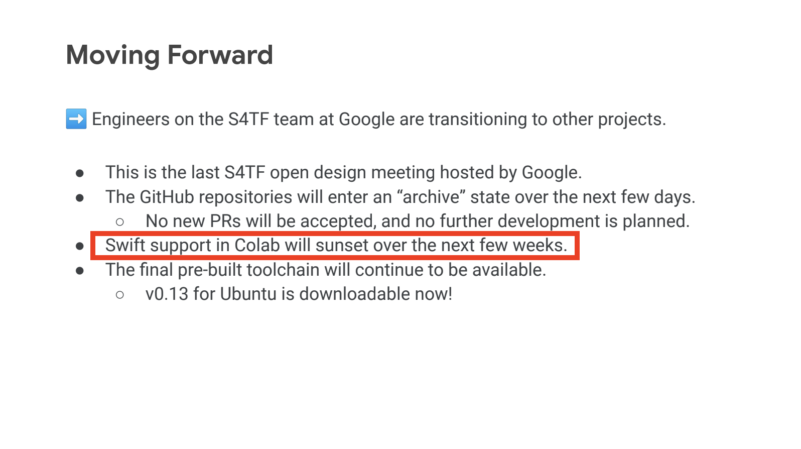

# History of Swift Support in Google Colab

In the last meeting of the original Swift for TensorFlow team (accessed fom the [Open Design Meeting Notes](https://docs.google.com/document/d/1Fm56p5rV1t2Euh6WLtBFKGqI43ozC3EIjReyLk-LCLU/edit)), there was a Google Slides presentation titled ["S4TF History - The [Incomplete] Insider Edition"](https://drive.google.com/file/d/1vxSIRq7KEmrFNAV_E0Wr7Pivn728Wcvs/view). On slide 21, they announced that "Swift support in Colab will sunset over the next few weeks". The presentation was given on February 12, which means support actually ended in March 2021.

The official Swift support came from a built-in Jupyter kernel, cloned from [google/swift-jupyter](https://github.com/google/swift-jupyter). Based on that repository's README, Google may have pre-installed the latest custom S4TF toolchain on their Colab servers, ready to be accessed by the kernel.

When Swift came back to Google Colab in January 2022, 
